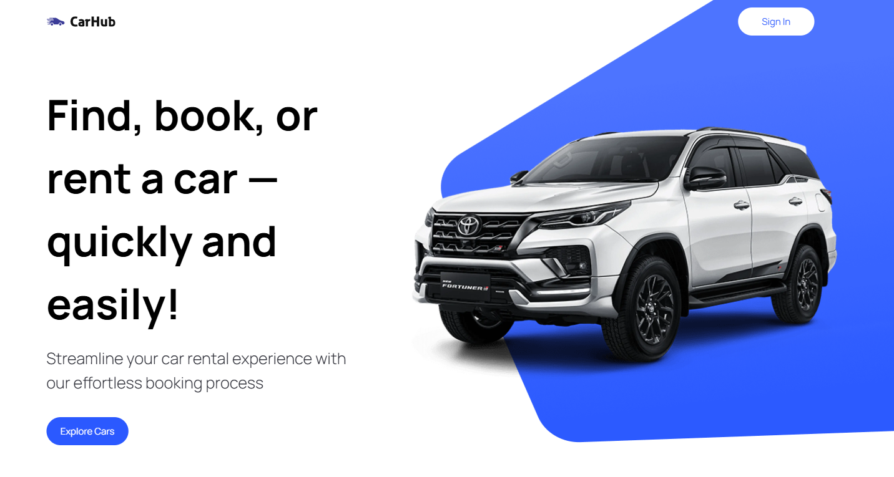

# 🚗 CarHub

CarHub is a modern, responsive web application that allows users to explore, filter, and view detailed information about various car models. It’s designed to help users find the perfect vehicle based on their preferences in make, model, fuel type, and more.

## 🛠 Tech Stack

- **Frontend**: Next.js, React, Tailwind CSS
- **API**: [api_link](https://rapidapi.com/apininjas/api/cars-by-api-ninjas)
- **Deployment**: Vercel

